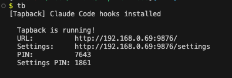
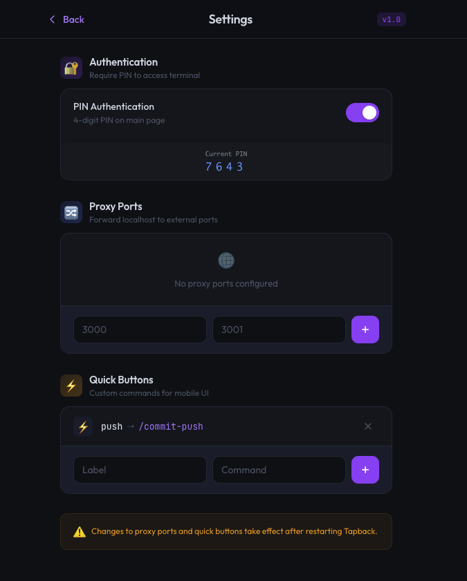
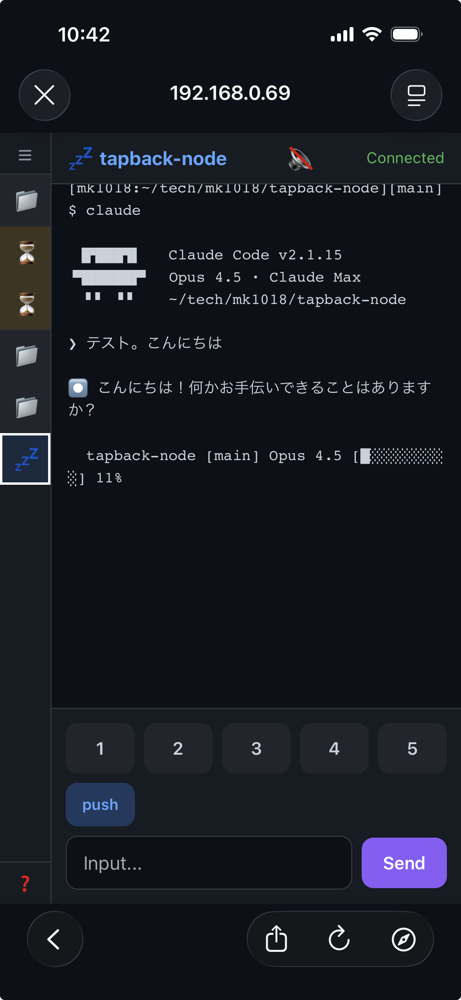

# Tapback

モバイル端末からClaude Code/Codexのターミナルを監視・操作するNode.js CLIツール。

tmuxセッションの出力をWebSocket経由でリアルタイム配信し、スマホからターミナルの閲覧・コマンド入力ができます。

<p align="center">
  <br>
  <em>ターミナル起動画面 — URL・PIN・設定情報を表示</em>
</p>
<p align="center">
  <br>
  <em>設定画面 — PIN認証・プロキシポート・クイックボタンの管理</em>
</p>
<p align="center">
  <br>
  <em>モバイルUI — tmux出力のリアルタイム表示とコマンド送信</em>
</p>

## 機能

- tmuxセッションのリアルタイム監視（1秒間隔）
- モバイルからのコマンド送信
- Claude Codeのステータス表示（hooks連携）
- localhostアプリのリバースプロキシ
- PIN認証（メインページ・設定ページで別PIN）
- Web設定画面（プロキシポート、クイックボタン）

## インストール

```bash
npm install -g tapback-cli
```

## 使い方

```bash
# 基本起動（ポート9876）
tb

# ポート指定
tb 8080

# リバースプロキシ付き（localhost:3000 → :3001で外部公開）
tb --proxy 3000:3001

# PIN認証を無効化
tb --no-pin
```

### ローカル開発

```bash
npm install

node bin/cli.js
PORT=9877 node bin/cli.js
node bin/cli.js --proxy 3000:3001
node bin/cli.js --no-pin
```

起動すると以下が表示されます：

```text
  Tapback is running!
  URL:          http://192.168.x.x:9876/
  Settings:     http://192.168.x.x:9876/settings
  PIN:          1234
  Settings PIN: 5678
```

スマホで表示されたURLにアクセスし、PINを入力してください。

## 設定

設定は`~/.config/tapback/config.json`に保存されます。Web UIの`/settings`からも編集可能です。

```json
{
  "pinEnabled": true,
  "proxyPorts": { "3000": 3001 },
  "quickButtons": [{ "label": "push", "command": "/commit-push" }]
}
```

## Claude Code連携

起動時にClaude Codeのhooksを自動設置します（`~/.claude/hooks/tapback-status-hook.sh`）。
Claude Codeのセッション状態（starting/processing/idle/waiting/ended）がリアルタイムでモバイルUIに反映されます。

## 必要環境

- Node.js 18+
- tmux
- macOS（ローカルIP取得にen0を使用）
